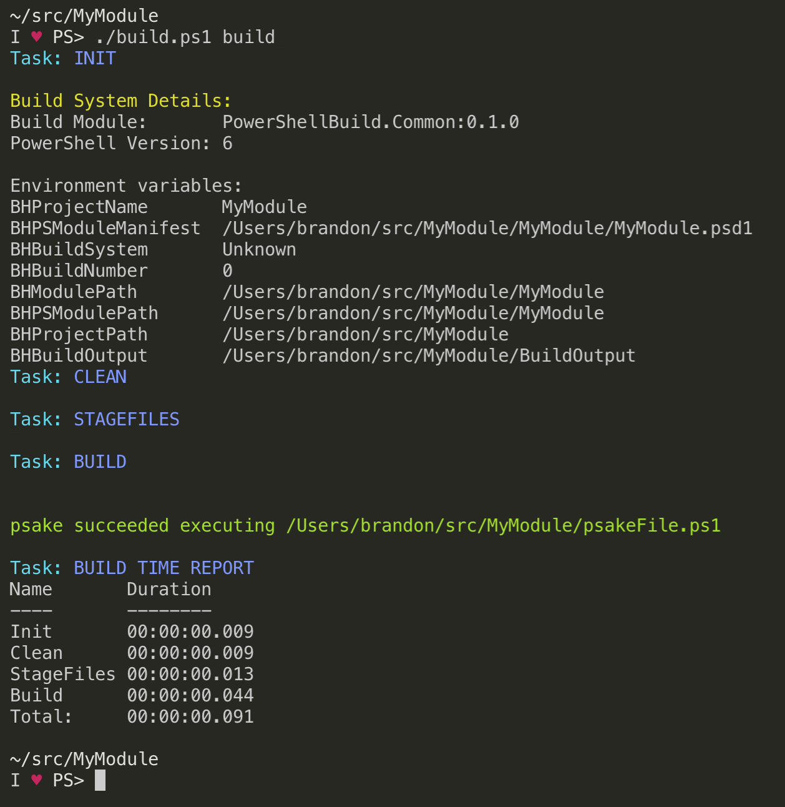

# PowerShellBuild.Common

This project aims to provide common [psake](https://github.com/psake/psake) tasks for building, testing, and publishing PowerShell modules.

Using these shared tasks reduces the boilerplate scaffolding needed in most PowerShell module projects and help enforce a consistent module structure.
This consistency ultimately helps the community in building high-quality PowerShell modules.

> psake version `4.8.0` or greater is required to make use of shared psake tasks.

<p align="center">
    
</p>

## Status - Work in progress

> This project is a **work in progress** and may change significantly before release based on feedback from the community.
> **Please do not base critical processes on this project** until it has been further refined.
>
> This is in part based on [PlasterBuild](https://github.com/PowerShell/PlasterBuild) project and _MAY_ be merged into it.
> It is being kept separate for now so experimental features can be explored.

## Tasks

**PowerShellBuild.Common** is a PowerShell module that provides helper functions to handle the common build, test, and release steps typically found in PowerShell module projects.
These steps are further exposed as a set of [psake](https://github.com/psake/psake) tasks found in [psakeFile.ps1](./PowerShellBuild.Common/psakeFile.ps1) in the root of the module.
In psake `v4.8.0`, a feature was added to reference shared psake tasks distributed within PowerShell modules.
This allows a set of tasks to be versioned, distributed, and called by other projects.

### Primary psake tasks

These primary tasks are the main tasks you'll typically call as part of PowerShell module development.

| Name                  | Dependencies                          | Description |
| --------------------- | ------------------------------------- | ----------- |
| Init                  | _none_                                | Initialize psake and task variables
| Clean                 | init                                  | Clean output directory
| Build                 | Init, Clean                           | Clean and build module in output directory
| Analyze               | Build                                 | Run PSScriptAnalyzer tests
| Pester                | Build                                 | Run Pester tests
| Test                  | Analyze, Pester                       | Run combined tests
| BuildHelp             | Build, GenerateMarkdown, GenerateMAML | Build all help files

### Secondary psake Tasks

These secondary tasks are called as dependencies from the primary tasks but may also be called directly.

| Name                  | Dependencies     | Description |
| --------------------- | -----------------| ----------- |
| StageFiles            | Clean            | Build module in output directory
| GenerateMarkdown      | Build            | Build markdown-based help
| GenerateMAML          | GenerateMarkdown | Build MAML help
| GenerateUpdatableHelp | BuildHelp        | Build updatable help cab

## Task customization

TODO

## Examples

The example below is a psake file you might use in your PowerShell module.
When psake executes this file, it will recognize that tasks are being referenced from a separate module and automatically load them.
You can run these tasks just as if they were included directly in your task file.

Notice that the task file contained in `MyModule` only references the `Build` task supplied from `PowerShellBuild.Common`.
When executed, the dependent tasks `Init`, `Clear`, and `StageFiles` also contained in `PowerShellBuild.Common` are executed as well.

###### psakeBuild.ps1

```powershell
properties {
    # These settings overwrite values supplied form the PowerShellBuild.Common
    # module and govern how those tasks are executed
    $scriptAnalysisEnabled = $false
    $codeCoverageEnabled = $true
}

task default -depends Build

task Build -FromModule PowerShellBuild.Common -Version '0.1.0'
```


