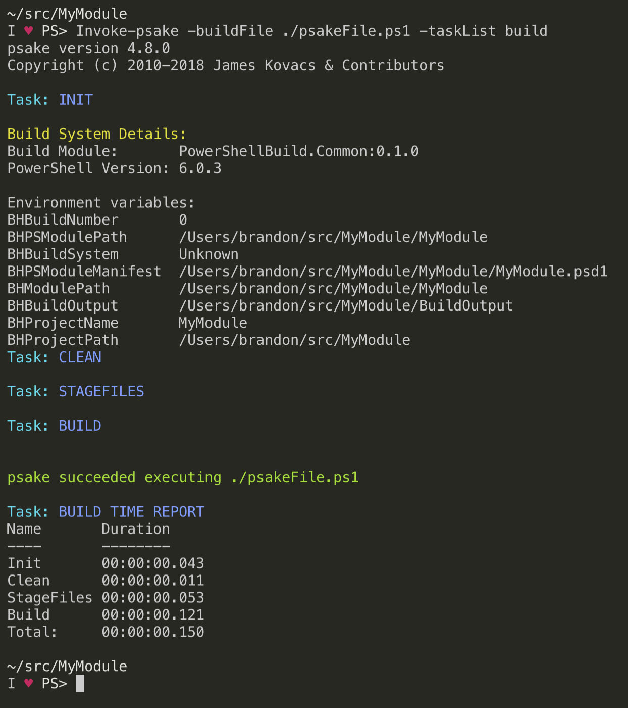
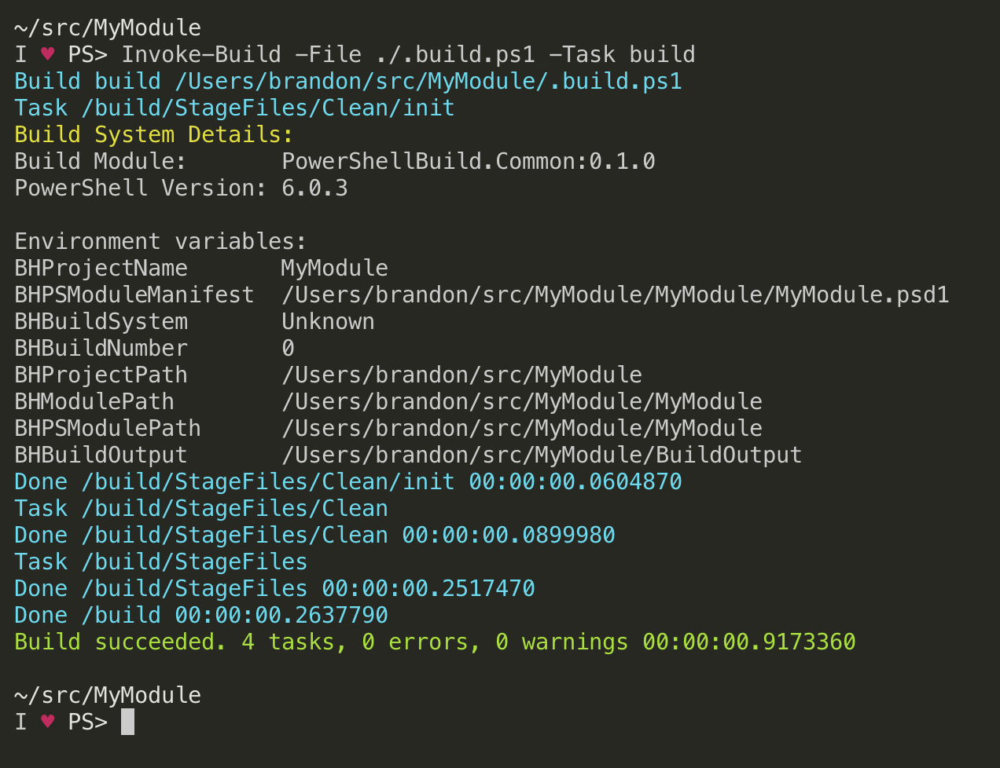

# PowerShellBuild.Common

This project aims to provide common [psake](https://github.com/psake/psake) and [Invoke-Build](https://github.com/nightroman/Invoke-Build) tasks for building, testing, and publishing PowerShell modules.

Using these shared tasks reduces the boilerplate scaffolding needed in most PowerShell module projects and help enforce a consistent module structure.
This consistency ultimately helps the community in building high-quality PowerShell modules.

> If using [psake](https://github.com/psake/psake) as your task runner, version `4.8.0` or greater is required to make use of shared tasks distributed in separate modules.
> Currently, `v4.8.0` of psake is unreleased and must be retrieved from the [shared-module-tasks](https://github.com/psake/psake/tree/shared-module-tasks) branch.
> For [Invoke-Build](https://github.com/nightroman/Invoke-Build), see the [how to dot source tasks using PowerShell aliases](https://github.com/nightroman/Invoke-Build/blob/master/Tasks/Import/README.md#example-2-import-from-a-module-with-tasks) example.

<p align="center">
    
</p>

## Status - Work in progress

> This project is a **work in progress** and may change significantly before release based on feedback from the community.
> **Please do not base critical processes on this project** until it has been further refined.
>
> This is in part based on the [PlasterBuild](https://github.com/PowerShell/PlasterBuild) project and _MAY_ be merged into it.
> It is being kept separate for now so experimental features can be explored.

## Tasks

**PowerShellBuild.Common** is a PowerShell module that provides helper functions to handle the common build, test, and release steps typically found in PowerShell module projects.
These steps are exposed as a set of [psake](https://github.com/psake/psake) tasks found in [psakeFile.ps1](./PowerShellBuild.Common/psakeFile.ps1) in the root of the module, and as PowerShell aliases which you can dot source if using [Invoke-Build](https://github.com/nightroman/Invoke-Build).
In psake `v4.8.0`, a feature was added to reference shared psake tasks distributed within PowerShell modules.
This allows a set of tasks to be versioned, distributed, and called by other projects.

### Primary Tasks

These primary tasks are the main tasks you'll typically call as part of PowerShell module development.

| Name                  | Dependencies                          | Description |
| --------------------- | ------------------------------------- | ----------- |
| Init                  | _none_                                | Initialize psake and task variables
| Clean                 | init                                  | Clean output directory
| Build                 | Init, Clean                           | Clean and build module in output directory
| Analyze               | Build                                 | Run PSScriptAnalyzer tests
| Pester                | Build                                 | Run Pester tests
| Test                  | Analyze, Pester                       | Run combined tests
| BuildHelp             | Build, GenerateMarkdown, GenerateMAML | Build all help files

### Secondary Tasks

These secondary tasks are called as dependencies from the primary tasks but may also be called directly.

| Name                  | Dependencies     | Description |
| --------------------- | -----------------| ----------- |
| StageFiles            | Clean            | Build module in output directory
| GenerateMarkdown      | Build            | Build markdown-based help
| GenerateMAML          | GenerateMarkdown | Build MAML help
| GenerateUpdatableHelp | BuildHelp        | Build updatable help cab

## Task customization

The psake and Invoke-Build tasks can be customized by overriding the following settings that are defined in the module.
These settings govern if certain tasks are executed or set default paths used to build and test the module.
You can override these in either psake or Invoke-Build to match your environment.

| Setting | Default value | Description |
|---------|---------------|-------------|
| $projectRoot | $env:BHProjectPath | Root directory for the project
| $srcRootDir | $env:BHPSModulePath | Root directory for the module
| $moduleName | $env:BHProjectName | The name of the module. This should match the basename of the PSD1 file
| $moduleVersion | \<computed> | The version of the module
| $moduleManifestPath | $env:BHPSModuleManifest | Path to the module manifest (PSD1)
| $outDir | $outDir/$moduleName/$moduleVersion | Output directory when building the module
| $compileModule | $false | Controls whether to "compile" module into single PSM1 or not
| $updatableHelpOutDir | $OutDir/UpdatableHelp | Output directory to store update module help (CAB)
| $defaultLocale | (Get-UICulture).Name | Default locale used for help generation
| $convertReadMeToAboutHelp | $false | Convert project readme into the module about file
| $scriptAnalysisEnabled | $true | Enable/disable use of PSScriptAnalyzer to perform script analysis
| $scriptAnalysisFailBuildOnSeverityLevel | Error | PSScriptAnalyzer threshold to fail the build on
| $scriptAnalyzerSettingsPath | ./ScriptAnalyzerSettings.psd1 | Path to the PSScriptAnalyzer settings file
| $testingEnabled | $true | Enable/disable Pester tests
| $testRootDir | $projectRoot/tests | Directory containing Pester tests
| $codeCoverageEnabled | $false | Enable/disable Pester code coverage reporting
| $codeCoverageThreshold | .75 | Fail Pester code coverage test if below this threshold
| $codeCoverageFiles | *.ps1, *.psm1 | Files to perform code coverage analysis on
| $testOutputFile | $null | Output file path Pester will save test results to
| $testOutputFormat | NUnitXml | Test output format to use when saving Pester test results
| $docsRootDir | $projectRoot/docs | Directory PlatyPS markdown documentation will be saved to

## Examples

### psake

The example below is a psake file you might use in your PowerShell module.
When psake executes this file, it will recognize that tasks are being referenced from a separate module and automatically load them.
You can run these tasks just as if they were included directly in your task file.

Notice that the task file contained in `MyModule` only references the `Build` task supplied from `PowerShellBuild.Common`.
When executed, the dependent tasks `Init`, `Clear`, and `StageFiles` also contained in `PowerShellBuild.Common` are executed as well.

###### psakeBuild.ps1

```powershell
properties {
    # These settings overwrite values supplied form the PowerShellBuild.Common
    # module and govern how those tasks are executed
    $scriptAnalysisEnabled = $false
    $codeCoverageEnabled = $true
}

task default -depends Build

task Build -FromModule PowerShellBuild.Common -Version '0.1.0'
```



### Invoke-Build

The example below is an [Invoke-Build](https://github.com/nightroman/Invoke-Build) task file that imports the `PowerShellBuild.Common` module which contains the shared tasks and then dot sources the Invoke-Build task files that are referenced by the PowerShell alias `PowerShellBuild.Common.IB.Tasks`.
Additionally, certain settings that control how the build tasks operate are overwritten after the tasks have been imported.

```powershell
Import-Module PowerShellBuild.Common
. PowerShellBuild.Common.IB.Tasks

# Overwrite build settings contained in PowerShellBuild.Common
$scriptAnalysisEnabled = $true
$codeCoverageEnabled   = $false
```


